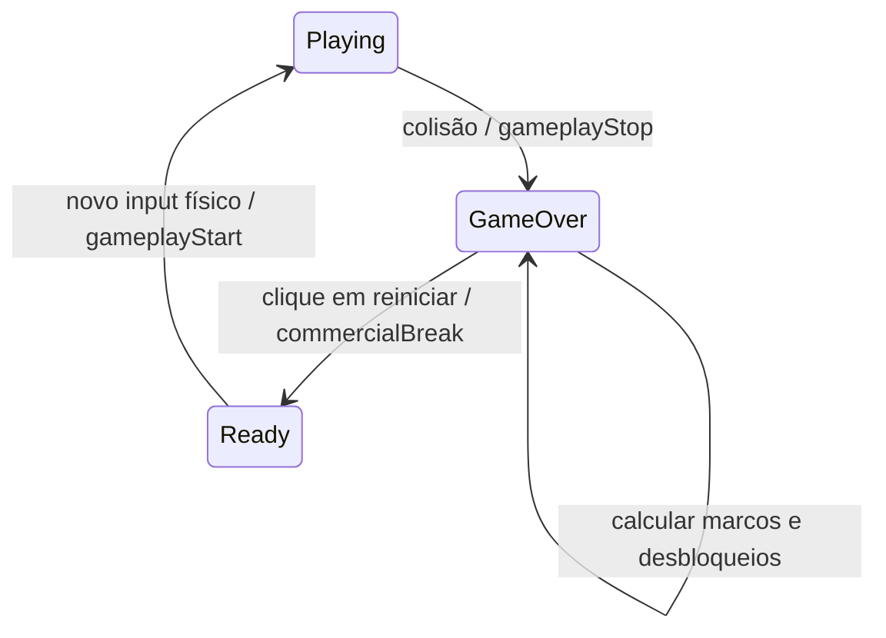

# Neon Dodge — Especificação de Evolução Neon

## Contexto

O Neon Dodge já possui core loop, recorde pessoal, onboarding e dificuldade progressiva. O ponto ainda insuficiente é `Return Motivation`: depois de morrer, o jogador tem um recorde para superar, mas não tem evolução persistente, coleção ou descoberta visual.

## Objetivo

Adicionar uma meta-progressão curta e visual que faça cada rodada responder a três perguntas:

1. O que eu conquistei?
2. O que desbloqueei?
3. O que devo alcançar na próxima rodada?

A progressão não pode modificar a justiça da mecânica principal, exigir conta, depender de rede ou impedir o jogador de começar imediatamente.

## Decisão de design

Implementar a **Evolução Neon**, composta por marcos de sobrevivência e recompensas cosméticas:

| Marco inicial | Recompensa | Exibição |
| ---: | --- | --- |
| 15 segundos | Transformação do personagem | Game Over e próxima Ready |
| 30 segundos | Skin magenta | Game Over e coleção |
| 45 segundos | Skin âmbar | Game Over e coleção |
| 60 segundos | Equipamento visual | Game Over e coleção |
| 90 segundos | Fase temática Cristal | Próxima rodada |
| 120 segundos | Forma avançada | Game Over e próxima Ready |
| 150 segundos | Fase temática Cósmica | Próxima rodada |

Esses valores são o primeiro conjunto de produto e podem ser recalibrados depois do playtest sem mudar o contrato do sistema.

### Regras de recompensa

- Recompensas são visuais ou de identidade: forma, skin, equipamento, tema e emblema.
- Nenhuma recompensa altera velocidade, colisão, troca de faixa, spawn ou tolerância do jogador.
- O desbloqueio acontece depois da rodada, dentro do estado `Game Over`, nunca interrompendo a ação ativa.
- Se uma rodada alcançar vários marcos, todos são processados uma única vez e apresentados em ordem.
- Um jogador pode equipar apenas conteúdos já desbloqueados.
- O próximo marco deve permanecer visível no estado `Ready`.

## Conteúdo inicial

O primeiro pacote visual deve ser pequeno e implementável com primitivas, cores e parâmetros já locais:

- 3 formas de personagem: forma inicial, forma evoluída e forma avançada.
- 3 skins: ciano, magenta e âmbar.
- 2 equipamentos: visor e trilha de energia.
- 3 temas: Cidade Neon, Túnel Cristal e Laboratório Cósmico.

Os temas alteram fundo, paleta e ambientação. A geometria dos obstáculos e o contraste de leitura permanecem estáveis.

## Fluxo de estados



- A tela de Game Over mostra a recompensa recém-desbloqueada, se houver.
- A mesma tela mostra o próximo marco e a distância restante.
- `commercialBreak()` continua condicionado ao clique explícito de reinício.
- A pausa comercial não libera `gameplayStart()` automaticamente.
- O adaptador Poki/CrazyGames permanece separado do sistema de progressão.

## UX para o público-alvo

O público de 9–12 anos será tratado como hipótese de playtest, não como um bloco homogêneo. A comunicação deve ser visual, curta e concreta:

- Mostrar personagem atual e próximo desbloqueio.
- Usar nomes simples e positivos: `Nova forma`, `Skin desbloqueada`, `Próximo tema`.
- Evitar árvore de habilidades, moedas, loja, inventário complexo e menus longos.
- Permitir jogar novamente com um toque.
- Não usar conta, chat, dados pessoais ou pressão de compra.

## Persistência e tolerância a falhas

Usar uma chave local versionada, por exemplo `neon-dodge-progression-v1`, com:

```json
{
  "version": 1,
  "highestMilestone": 0,
  "unlocked": ["form-default"],
  "equipped": {
    "form": "form-default",
    "skin": "skin-cyan",
    "equipment": null,
    "theme": "theme-city"
  }
}
```

- Toda leitura e gravação permanece dentro de `try/catch`.
- Dados inválidos retornam ao estado inicial seguro.
- Se o armazenamento falhar, usar progresso em memória e manter o jogo jogável.
- Nunca bloquear o input ou o reinício por falha de persistência.

## Fora de escopo nesta iteração

- Loja, monetização, compras ou moedas premium.
- Leaderboard online, conta, cloud save ou desafios dependentes de servidor.
- Recompensas que alterem a dificuldade ou deem vantagem mecânica.
- Grande volume de sprites, texturas ou áudio.
- Integração de SDK real de plataforma.

## Critérios de aceitação

- O jogador entende o próximo objetivo sem explicação externa.
- O primeiro desbloqueio é alcançável na primeira ou segunda tentativa de um jogador novo.
- O desbloqueio aparece sem interromper gameplay ativo.
- O reinício continua possível em um toque após Game Over.
- A progressão persiste após recarregar quando o armazenamento está disponível.
- O jogo permanece jogável quando o armazenamento está bloqueado.
- A mecânica e os eventos `gameplayStart`/`gameplayStop` mantêm as travas atuais.
- O pacote continua dentro do limite do build-base offline.

## Validação de produto

No playtest, observar:

- compreensão do próximo marco;
- taxa de segunda rodada;
- taxa de terceira rodada;
- tempo até o primeiro desbloqueio;
- número de jogadores que abrem a personalização;
- relatos de confusão, frustração ou recompensa sem significado.

O primeiro ciclo deve comparar o Neon Dodge atual contra a versão com Evolução Neon. As metas numéricas finais serão definidas após a coleta do baseline, sem transformar benchmarks arbitrários em requisito de plataforma.

## Decisão de implementação

Especificação aprovada pelo usuário em 2026-08-15 e implementada no commit de evolução Neon após o plano técnico correspondente.
